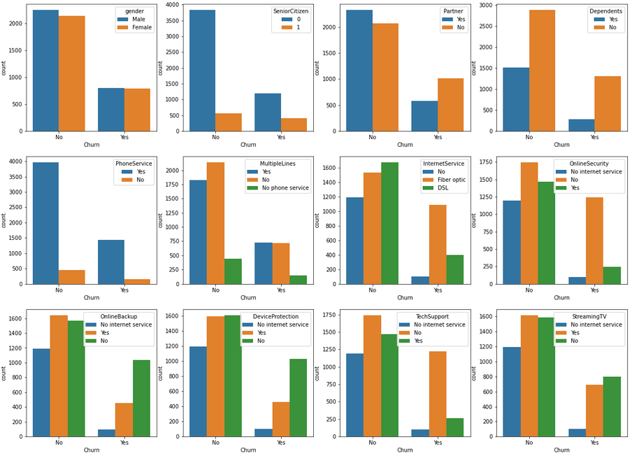
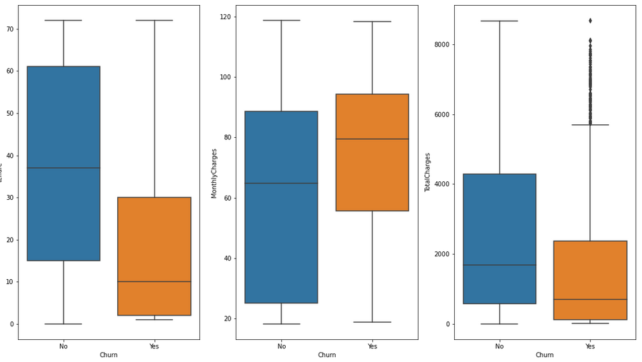
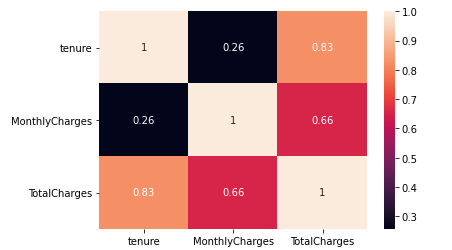
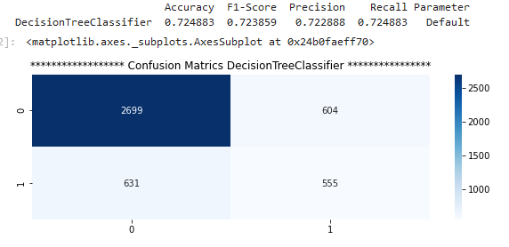
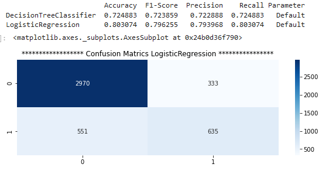
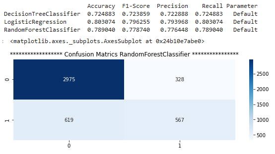
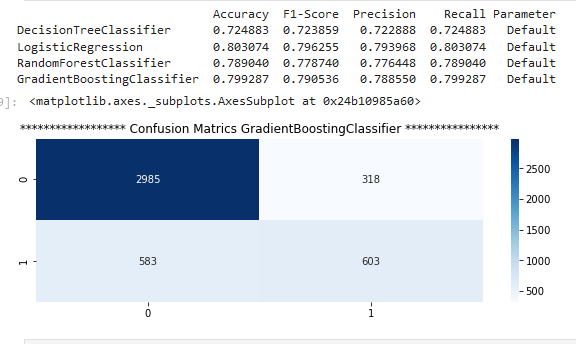

# Customer Churn Prediction

## Introduction
I will develop a classification model which can predict if a customer can leave the service in the future or not. To verify the performance of the model, I will use the following metrics:

Classification Metrics
- Accuracy.
- Precision
- Recall
- F1-Score
- Confusion Matrix

Here, only accuracy is not a good metric to verify the performance of the model as the data is highly imbalanced. For our case, I think Precision is important, which says among the total predicted for a category what percentage were correct predictions. This is due to the fact that if our model predicts someone will not leave the service and later if that person leaves, then it will be a loss for the company. Recall also seems a good metric which says of the total data available for a certain category, what percentage has returned correctly. This is because if there are many people who will leave the service, but our model is not able to identify them, it will again be a big loss for the company. Since we want precision and recall both to be high, I will check the F1-score as well, which is the harmonic mean of both. I will also use the confusion matrix, which can give detailed analysis of how the model is performing by drawing a comparison between actual and predicted values in the form of a matrix.

### Main File
- [telecom churn.ipynb](./telecom%20churn.ipynb): Notebook contains comparitive study about various statistical ways of comingup with importent features a comparitive study among multiple models.

## Summary of Steps

- Upon loading the data, I performed a few initial checks and found that the data was highly imbalanced.
- It contained 5986 rows and 22 columns.
- It did not contain any null values.
- There were 3 numeric and 19 categorical columns.
- Used chi-square test to check which all categorical columns are impacting categorical target ‘’Churn”.
- Used Annova test to check which all numerical columns are impacting categorical target ‘’Churn”.
- Used correlation and VIF to verify if there is any collinearity in data.
- Tried standard scaling on numeric features and one-hot encoding with categorical columns.
- Did a comparative study among multiple models, first with all columns and then with only selected columns (selected after chi-square and Annova test).
- Did hyperparameter tuning to get the best model possible.
- Tried deep learning model MLP on this data to check how does it perform.
- Eventually used Logistic regression and Gradient boosting to predict the test data and validate its performance.
- Used embedded technique to get important features. I used Gradient boosting to get the important features.

## Exploratory Data Analysis
### EDA on categorical predictor
First, I have tried analyzing what all categorical columns are contributing to the target variable ‘churn’. Please observe below figure and you will notice the following observations:

1. In the very first figure which is gender against churn, gender does not seem to have much impact on target churn. Distribution of male, female for each target type is the same. When churn is No, male female both increase in count whereas when churn is Yes, male, and female both decrease in count. So, gender (male, female) does not seem to be a strong predictor.
2. Similar pattern we can observe in the 1st figure of the 2nd row, which is PhoneService against target churn. Distribution of male, female for each target is the same.
3. Rest categorical columns follow a different pattern against target churn for its different values ('Yes', 'No'). So those all seem to be good predictors for the task at hand.

### EDA on numerical predictor
Now let’s see how numerical columns are impacting the target ‘churn’. Following are observations of the below figure:

- Customers churn when tenure is low.
- Customers churn when monthly charges are higher.
- Customers churn when total charges are low.
For each numerical column, the average value changes for different values of the target, so all of them seem to be good predictors for this task.

## Collinearity Check
Now let’s check if we have collinearity in our data. For this, we will first draw correlation among numerical predictors. Below is the result:

In the above figure, TotalCharges seems to be highly correlated with tenure. To be certain if we have collinearity, we will check the variance inflation factor (VIF) score as well. Note that normally if a column has a VIF score greater than 5, then it is considered to be collinear with some other column.

## Model Training
Now let us train a model first without removing any predictor and see what result we are getting. We will use multiple models and perform a comparative study to select the best model. Before fitting the model, first we will divide the whole data into train and test parts in a 70:30 ratio, respectively. We will apply 5-fold cross-validation on the train part, and eventually, the model with the best cross-validation score will be used to predict the test data and validate its performance on the test data.

Below is the result obtained after fitting models on complete train data without removing any columns. As you can see, logistic regression has performed the best among all with 0.79 F1-Score.

## Hyperparameter Tuning
Now let’s try hyperparameter tuning to get the best possible score. We will use GridSearchCV for this purpose.

Below are the `best_score_` and `best_params_` after grid search on different models:

- Decision Tree:
  - Best Score: 0.805
  - Best Parameters: {'max_depth': 6, 'min_samples_split': 2, 'splitter': 'best'}

- Logistic Regression:
  - Best Score: 0.835
  - Best Parameters: {'C': 0.1, 'penalty': 'l2', 'solver': 'liblinear'}

- Random Forest:
  - Best Score: 0.818
  - Best Parameters: {'max_depth': 10, 'min_samples_split': 2, 'n_estimators': 100}

- Gradient Boosting:
  - Best Score: 0.843
  - Best Parameters: {'learning_rate': 0.1, 'max_depth': 6, 'min_samples_split': 2, 'n_estimators': 100, 'subsample': 0.8}

Again, we have got logistic regression to be performing the best. Gradient Boosting also somewhat closer to logistic regression in performance.

## Deep Learning Model (MLP)
Now let’s try using a deep learning model (MLP) and check how does it perform on this data.

The best score that I could get with MLP after tuning its various parameters such as activation function, number of neurons, and layers was 0.827.

## Model Selection and Test Data Performance
Eventually, the models that have performed the best so far are logistic regression and gradient boosting. Let's check what score they are giving on the test data. Below are the results:

### Logistic Regression:
- Accuracy: 0.827
- Precision: 0.682
- Recall: 0.660
- F1-Score: 0.671

### Gradient Boosting:
- Accuracy: 0.837
- Precision: 0.688
- Recall: 0.683
- F1-Score: 0.685

## Conclusion
According to my analysis, gradient boosting is the best-performing model. One advantage of this is that getting important attributes is very handy. Below are the important attributes as per this model:
1. MonthlyCharges
2. TotalCharges
3. Tenure
4. InternetService
5. PaymentMethod
6. Contract
7. TechSupport
8. OnlineSecurity
9. OnlineBackup
10. PaperlessBilling

Most important is at the 1st position and the least important is at the last position.
